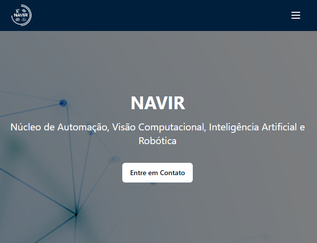

# 🔬🚀 NAVIR - Núcleo de Pesquisa do ICET/UFAM

Este é um projeto de apresentação e experimentação do **NAVIR**, o núcleo de pesquisa do ICET/UFAM.  
O projeto foi desenvolvido utilizando **React**, com animações em **Framer Motion** e navegação gerenciada pelo **React Router**.




## 🔥 Funcionalidades

- Animações interativas com **Framer Motion**.
- Navegação dinâmica entre seções utilizando **React Router**.
- Exibição das áreas de atuação:
  - **Automação:** Desenvolvimento de sistemas autônomos e eficientes.
  - **Visão Computacional:** Processamento e análise avançada de imagens.
  - **Inteligência Artificial:** Soluções inteligentes para problemas complexos.
  - **Robótica:** Inovação em sistemas robóticos.
- Interface responsiva e com design moderno.

## 🛠️ Tecnologias Utilizadas

- [React](https://react.dev/)
- [Framer Motion](https://www.framer.com/motion/)
- [React Router](https://reactrouter.com/)
- [Node.js](https://nodejs.org/)
- [Tailwind CSS](https://tailwindcss.com/) 

### ✅ Requisitos

- [Node.js](https://nodejs.org/) versão 16 ou superior
- [npm](https://www.npmjs.com/) ou [yarn](https://yarnpkg.com/)

## 🚀 Como Rodar o Projeto

1. **Clone o repositório:**

    ```bash
    git clone https://github.com/rennan-dev/navir.git
    ```

2. **Acesse a pasta do projeto:**

    ```bash
    cd navir/codigo_fonte/frontend
    ```

3. **Instale as dependências:**

    ```bash
    npm install
    ```

4. **Rode o projeto:**

    ```bash
    npm run dev
    ```

5. **Abra o navegador e acesse:**

    ```
    http://localhost:5173
    ```

## 📂 Estrutura do Projeto

- `src/pages/Home.jsx` – Componente principal que exibe a página inicial com animações e as áreas de atuação.
- `src/components/ui` – Componentes de interface reutilizáveis, como botões e toasts.
- `public/images` – Arquivos de imagem utilizados no projeto, incluindo o fundo.
- `src/App.jsx` – Configuração das rotas e estrutura principal da aplicação.

## 🎨 Layout

- Design moderno e responsivo, com foco na apresentação clara das informações.
- Animações suaves que destacam a interatividade do site.
- Integração visual que reforça a identidade do NAVIR, unindo tecnologia e pesquisa.

## 📄 Licença

Este projeto está licenciado sob os termos da [Licença MIT](./LICENSE).

Desenvolvido pelo Núcleo de Pesquisa do ICET/UFAM.
